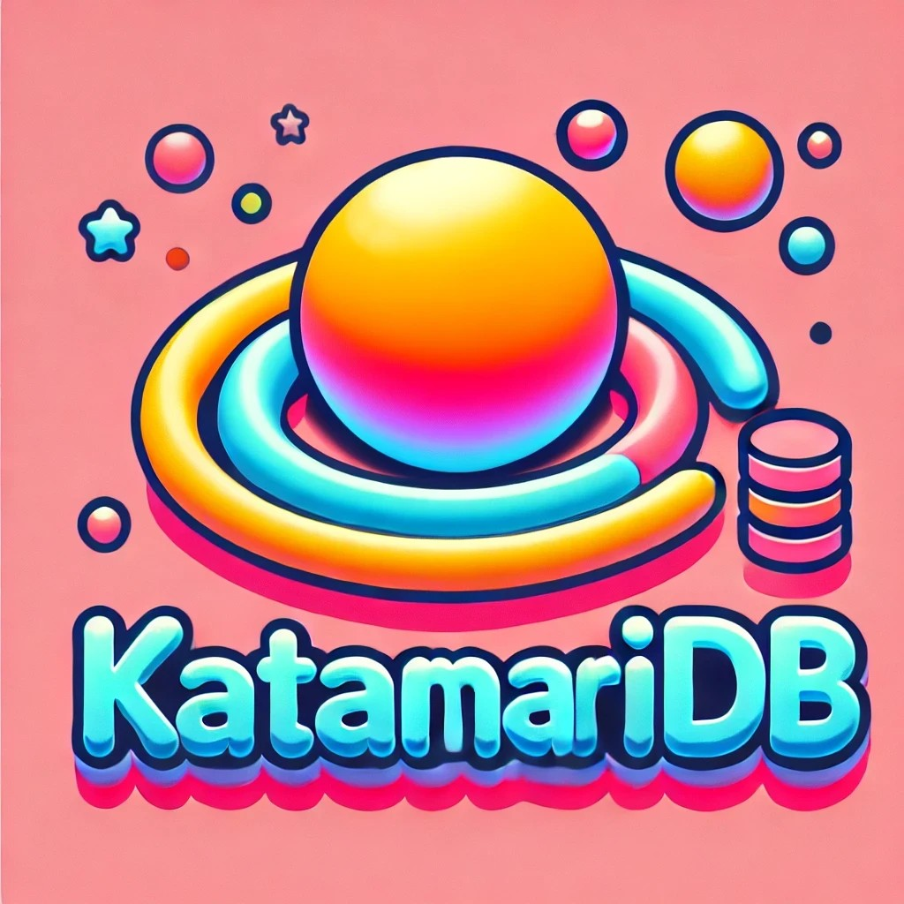
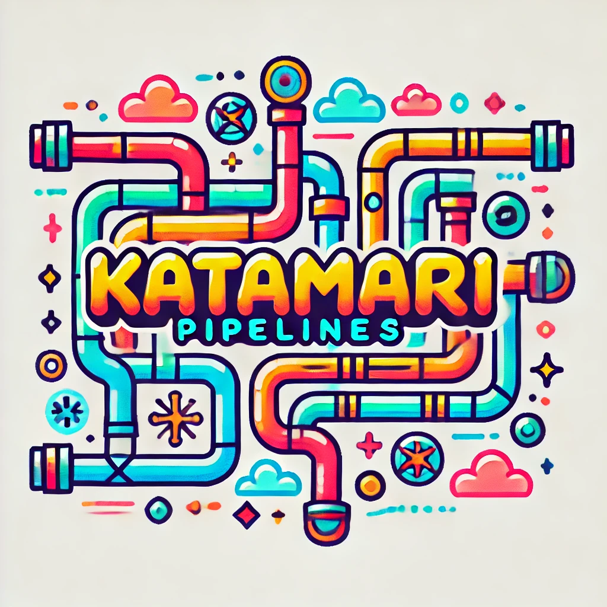

Katamari Ecosystem
Welcome to the Katamari Ecosystem, a modular, event-driven architecture designed to offer a flexible, end-to-end solution for handling distributed workloads, data pipelines, message queuing, serverless functions, real-time UI rendering, dynamic metric aggregation, identity and access management, encryption, infrastructure-as-code (IAC), and more. The Katamari Ecosystem integrates its components seamlessly to provide modern, scalable, data-driven infrastructure for a wide range of applications.

Key Components of the Katamari Ecosystem
The Katamari Ecosystem consists of tightly integrated components, each specialized for specific tasks. Together, they form a powerful, cohesive, event-driven system:

KatamariDB

A file-based, highly flexible key-value store inspired by MongoDB and Redis, with Elasticsearch-like query capabilities.
Features a Multi-Version Concurrency Control (MVCC) system and a full-fledged Object-Relational Mapping (ORM) for advanced query handling and schema management.
KatamariPipelines

A pipeline execution framework that orchestrates ETL (Extract, Transform, Load) processes and real-time data streaming.
Seamlessly integrates with KatamariDB and KatamariLambda to manage workflows in an event-driven manner, ensuring efficient and responsive data handling.
KatamariMQ

A distributed message queue system designed for workload distribution, data sharding, and dynamic task management.
Works in conjunction with KatamariLambda to execute serverless functions triggered by events, ensuring both scalability and resilience.
KatamariLambda

A serverless compute platform that supports event-driven, distributed function execution.
Provides the ability to define, schedule, and execute serverless functions, tightly integrated with KatamariMQ for dynamic task execution across distributed nodes.
KatamariUI
An asynchronous UI framework based on FastAPI and WebSockets, enabling real-time dynamic page rendering and interactive components.
Supports theming, notifications, and visualizations, making it ideal for building real-time dashboards, admin interfaces, and responsive web applications.
KatamariCharts
A flexible charting component that supports both Chart.js and Matplotlib for creating rich, interactive data visualizations.
Integrates easily with KatamariUI, enabling real-time data-driven visualizations for dashboards and analytics.
KatamariAggregation
A real-time, dynamic metric aggregation engine built on top of KatamariDB and KatamariORM.
Allows users to define custom metrics and compute them over both real-time data streams and historical datasets, making it ideal for monitoring, performance tracking, and analytics.
KatamariIAM
A robust Identity and Access Management (IAM) solution integrated with KatamariDB and supporting multiple authentication methods.
Provides OAuth2, JWT-based authentication, and API key-based access for users and service accounts.
Features role-based access control (RBAC), multi-factor authentication support, session management, and argon2-based password hashing for secure user management.
Seamlessly integrates with other Katamari Ecosystem components to secure access to data, services, and functions.
KatamariKMS
A key management service (KMS) that provides encryption and decryption for sensitive data.
Utilizes AES encryption for managing keys and secrets, leveraging KatamariMVCC for consistent, versioned key handling.
Works seamlessly with KatamariVault for storing and managing secrets securely.
KatamariVault
A secure secret management solution for the Katamari Ecosystem, integrated with KatamariKMS.
Stores and retrieves secrets such as API keys, database credentials, and other sensitive data.
Encrypts secrets using KatamariKMS before storing them, ensuring they remain secure and version-controlled.
KatamariCloudProviders
KatamariAWSProvider: A cloud provider manager using boto3 to interact with AWS services (e.g., EC2, Lambda, S3, IAM).
KatamariGCPProvider: A cloud provider manager using google.cloud SDK to manage GCP services (e.g., Compute, Cloud Functions, Storage).
KatamariAzureProvider: A cloud provider manager using azure-mgmt SDK to handle Azure services (e.g., VMs, Functions, Blob Storage).
All cloud providers are integrated with KatamariKMS for secure key management and KatamariVault for secrets handling.
KatamariIAC
KatamariIAC enables infrastructure-as-code (IAC) capabilities, allowing users to define, scale, and manage infrastructure across multiple cloud platforms.
Supports AWS, GCP, Azure, and a Dummy Provider for testing purposes.
Handles dry-runs, scaling, and failover between cloud providers using KatamariScaler and KatamariFailover components.
Integrated with KatamariKMS for managing keys and KatamariVault for secure credentials.
Getting Started
To begin exploring the Katamari Ecosystem, clone the repository and dive into the individual components located in the docs/ directory for detailed setup, configuration, and usage instructions.

bash
Copy code
git clone https://github.com/gddisney/katamari.git
Example Use Cases
End-to-End Event-Driven Architecture: Build fully reactive systems where real-time data flows through KatamariPipelines, is processed by KatamariLambda, and dynamically rendered in KatamariUI. Ideal for low-latency applications such as IoT, financial trading platforms, or real-time data aggregation.

Distributed Job Scheduling: Use KatamariMQ with KatamariLambda to distribute workloads across multiple nodes. This enables event-driven task execution, with built-in support for data sharding, making it scalable for large-scale systems.

Real-Time Dashboards and Alerts: Combine KatamariUI, KatamariCharts, and KatamariAggregation to build dynamic dashboards that automatically update with real-time data. Perfect for monitoring systems and visualizing metrics as they change in real-time.

Dynamic Metric Aggregation and Monitoring: Leverage KatamariAggregation to define custom metrics on the fly and calculate them over both real-time and historical data streams. This is ideal for application performance monitoring, alerting, and generating insightful analytics.

Identity and Access Management for Secure Applications: Use KatamariIAM to secure applications with OAuth2, JWT tokens, and API key-based authentication. Assign roles and permissions to users and service accounts, control access to resources, and manage secure authentication across your distributed system.

Multi-Cloud Infrastructure Management: Use KatamariCloudProviders (AWS, GCP, Azure) to manage and deploy infrastructure across multiple cloud platforms. Handle IAM, compute resources, object storage, and serverless functions with unified management. Use KatamariKMS for encryption and KatamariVault for secure secrets handling.

Infrastructure-as-Code: Use KatamariIAC to define infrastructure in YAML files and deploy across cloud providers. Leverage scaling and failover capabilities to maintain high availability in multi-cloud setups.

Ecosystem Components
Explore each component of the Katamari Ecosystem in detail:

KatamariDB: A flexible, file-based key-value store with MVCC and ORM capabilities, perfect for high-performance, scalable storage.
KatamariPipelines: Manage ETL workflows and real-time data processing with an event-driven execution model.
KatamariMQ: A powerful message queue for workload distribution, seamlessly integrated with serverless functions.
KatamariLambda: A serverless compute platform for distributed, event-driven function execution.
KatamariUI: A real-time UI framework for creating dashboards and admin interfaces with dynamic visualizations.
KatamariCharts: Integrates with KatamariUI to provide rich, interactive data visualizations.
KatamariAggregation: Real-time metric computation and aggregation over stored and streaming data.
KatamariIAM: A secure identity and access management system supporting multi-factor authentication, API keys, and role-based access control.
KatamariKMS: A key management service for handling encrypted secrets and API keys across the ecosystem.
KatamariVault: A secure storage system for managing secrets and credentials.
KatamariIAC: Infrastructure-as-code component to deploy and manage cloud infrastructure across AWS, GCP, and Azure.
License
This project is licensed under the terms of the MIT License.
