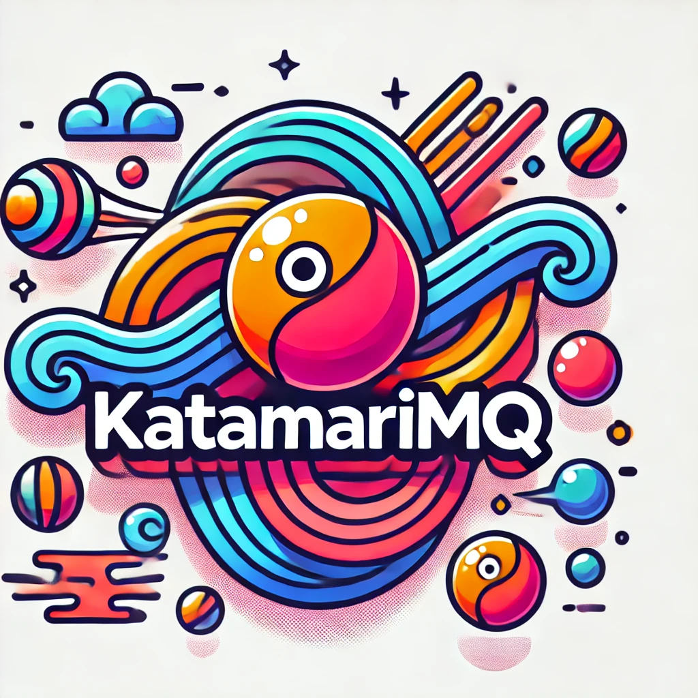

Here's the full markdown including the **WebP** images from the `\imgs` folder:

---

# Katamari Ecosystem

Welcome to the **Katamari Ecosystem**, a modular system designed to offer a flexible, end-to-end, event-driven architecture for handling distributed workloads, data pipelines, message queuing, serverless functions, real-time UI rendering, and much more. This ecosystem combines multiple components working together seamlessly to provide a complete infrastructure for modern, scalable, and data-driven applications.

## Key Components of the Katamari Ecosystem

The **Katamari Ecosystem** consists of tightly integrated components, each designed to handle specific tasks while working together to form a cohesive, event-driven system:

### KatamariDB


- A file-based, highly flexible key-value store inspired by MongoDB and Redis, using Elasticsearch-like queries.
- Offers a **simple-to-use, full-fledged ORM**, with capabilities such as **Multi-Version Concurrency Control (MVCC)**, advanced query support, and dynamic schema handling.

### KatamariPipelines


- A pipeline execution framework to manage ETL processes and real-time data streaming.
- Integrates seamlessly with **KatamariDB** and **KatamariLambda** to efficiently handle complex workflows in an event-driven manner.

### KatamariMQ


- A distributed message queue system designed for workload distribution, data sharding, and Lambda execution.
- Supports clustering and integrates with **KatamariLambda** for executing serverless functions in response to events, ensuring scalability and resilience.

### KatamariLambda


- A serverless compute platform that supports event-driven, distributed function execution.
- Enables the definition, scheduling, and execution of serverless functions, tightly coupled with **KatamariMQ** for dynamic task management.

### KatamariUI
- An asynchronous UI framework powered by FastAPI and WebSockets, supporting dynamic page rendering, real-time updates, and interactive components.
- Provides a user-friendly interface with theming, notifications, and real-time visualizations, ideal for building dashboards and admin tools.

### KatamariCharts
- A charting component that supports both **Chart.js** and **Matplotlib**, enabling rich data visualizations.
- Easily integrates with **KatamariUI**, allowing real-time data visualizations and historical analysis within user interfaces.

### KatamariAggregation
- A dynamic metric aggregation engine that operates on top of **KatamariDB** and **KatamariORM**.
- Enables users to define custom metrics dynamically and compute them over real-time data streams or stored data, making it ideal for monitoring and analytics.

---

## Getting Started

To get started with the **Katamari Ecosystem**, clone the repository and explore the individual components inside the `docs/` directory for detailed usage instructions and examples.

```bash
git clone https://github.com/gddisney/katamari.git
```

### Running Demos

Inside the **demos/** directory, you'll find several sample applications and projects that demonstrate the capabilities of the ecosystem. These include:

- **WordPress Clone**: A CMS that showcases how to use **KatamariUI** and **KatamariDB** for content management.
- **Twitter Clone**: A real-time social media platform using **KatamariMQ** and **KatamariLambda** to distribute and handle workloads dynamically.
- **News RSS Aggregator**: Demonstrates data aggregation and ETL processes using **KatamariPipelines**.
- **Tabulae Clone**: A comprehensive example of complex data processing and visualization using **KatamariAggregation** and **KatamariCharts**.

Each demo showcases how to integrate and utilize multiple components of the **Katamari Ecosystem** in real-world scenarios.

---

## Example Use Cases

1. **End-to-End Event-Driven Architecture**: Create a fully reactive system where real-time data streams through **KatamariPipelines**, gets processed by **KatamariLambda**, and visualized dynamically in **KatamariUI**. Perfect for applications requiring low-latency responses like IoT, financial trading, or data aggregation.

2. **Distributed Job Scheduling**: Use **KatamariMQ** in conjunction with **KatamariLambda** to distribute workloads across multiple nodes, enabling parallel, event-driven task execution. With data sharding support, **KatamariMQ** can handle even the largest datasets efficiently.

3. **Real-Time Dashboards and Alerts**: Combine **KatamariUI**, **KatamariCharts**, and **KatamariAggregation** to create dashboards that display dynamically updated metrics, data visualizations, and system status changes as they happen in real time.

4. **Dynamic Metric Aggregation and Monitoring**: Use **KatamariAggregation** to define custom metrics on-the-fly and compute them over real-time data streams. It's perfect for application performance monitoring, alerting, and creating sophisticated data insights.

---

## License

This project is licensed under the terms of the [MIT License](LICENSE).

For detailed information on each component, refer to the individual documentation files listed below:

- [KatamariDB Documentation](docs/KatamariDB.md)
- [KatamariPipelines Documentation](docs/KatamariPipelines.md)
- [KatamariMQ Documentation](docs/KatamariMQ.md)
- [KatamariLambda Documentation](docs/KatamariLambda.md)
- [KatamariUI Documentation](docs/KatamariUI.md)
- [KatamariCharts Documentation](docs/KatamariCharts.md)
- [KatamariAggregation Documentation](docs/KatamariAggregation.md)

---

The **Katamari Ecosystem** represents one of the first comprehensive, event-driven frameworks designed to tackle the challenges of modern, distributed applications. With components that cover everything from data storage, job scheduling, real-time UI, to dynamic metrics aggregation, the ecosystem is ready to support a wide range of use cases, ensuring developers have a robust foundation to build on.

Explore the power of the **Katamari Ecosystem** and see how it can transform your approach to building scalable, data-driven, event-centric applications.
